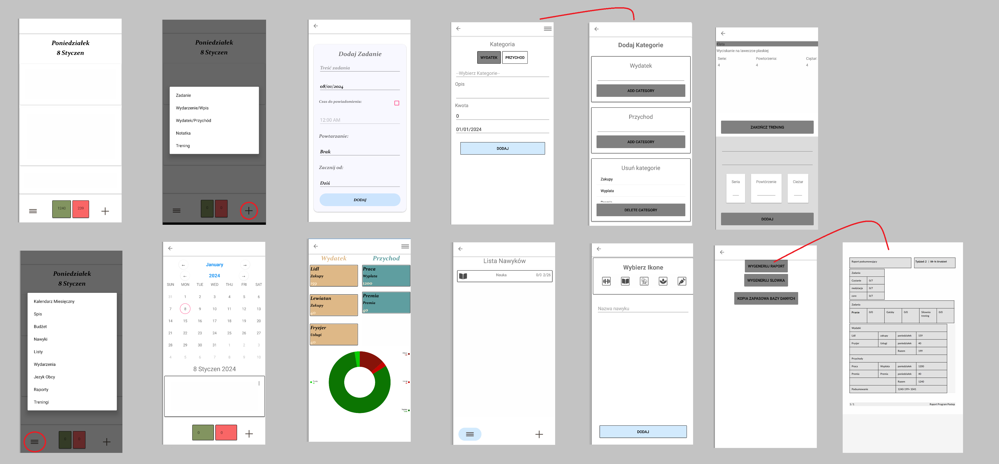

<h1>Aplikacja do monitorowania codziennych czynności użytkowych na platforme Android/OS </h1>

Aplikacja została stworzona w celu monitorowania czynności powtarzających się
takich jak:
 - Monitorowanie nawyków i zadań 
 - Analiza wydatkow i przychodów
 - Tworzenie raportów i generowanie pdf ( QuestPDF)
 - Powiadomienia lokalne 

 <h2>Do Dodanie</h2>
 
- [ ] Polaczenie z API
- [ ] Refaktoryzacja
- [ ] Google - Azure Hub Notification
- [ ] Login system
- [ ] Tryb Ciemny/Jasny
